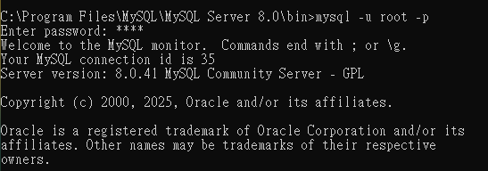

# Assignment - Week 5
## Task 1: Install MySQL server
### 成功安裝並登入MySQL

## Task 2: Create database and table in your MySQL server
### Create a new database named website.

### Create a new table named member, in the website database.

## Task 3: SQL CRUD
### INSERT a new row to the member table where name, username and password must be set to <u>test</u> INSERT additional 4 rows with arbitrary data.

### SELECT all rows from the member table.

### SELECT all rows from the member table, in descending order of time.

### SELECT total 3 rows, second to fourth, from the member table, in descending order of time.

### SELECT rows where username equals to <u>test</u>.  

### SELECT rows where name includes the <u>es</u> keyword.

### SELECT rows where both username and password equal to <u>test</u>.

### UPDATE data in name column to <u>test2</u> where username equals to <u>test</u>.

## Task 4: SQL Aggregation Functions
### Change the follow_count of all the rows (optional).

### SELECT how many rows from the member table.

### SELECT the sum of follower_count of all the rows from the member table.

### SELECT the average of follower_count of all the rows from the member table.

### SELECT the average of follower_count of the first 2 rows, in descending order of follower_count, from the member table.

## Task 5: SQL JOIN
### Create a new table named message, in the website database.

### SELECT all messages, including sender names. We have to JOIN the member table to get that.

### SELECT all messages, including sender names, where sender username equals to <u>test</u> We have to JOIN the member table to filter and get that.

### Use SELECT, SQL Aggregation Functions with JOIN statement, get the average like count of messages where sender username equals to <u>test</u>.

### Use SELECT, SQL Aggregation Functions with JOIN statement, get the average like count of messages GROUP BY sender username.
